# Movies-ETL
Module 8: ETL - Extract, Transform, Load

## Project Overview
create an automated pipeline that takes in new data, performs the appropriate transformations, and loads the data into existing tables. 

## Resources
Data Source: ratings.csv, wikipedia-movies.csv, movies_metadata.csv
Software: ProsgreSQL, PGAdmin, Python 3.9.0, Anaconda Navigator 2.1.1, Jupyter Notebook 6.4.6

## Results
### Deliverable 1: Write an ETL Function to Read Three Data Files
- ETL function 
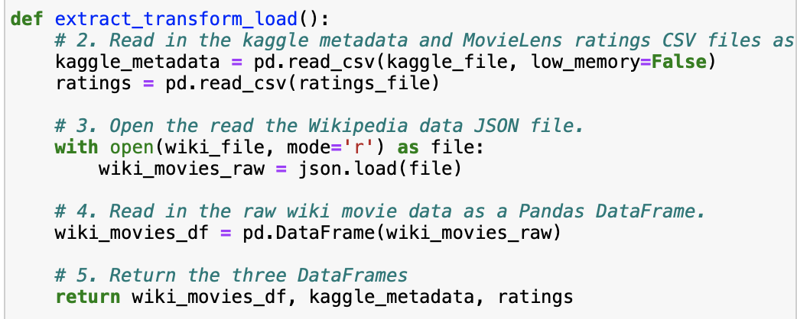

- The *wiki_movies_df* DataFrame
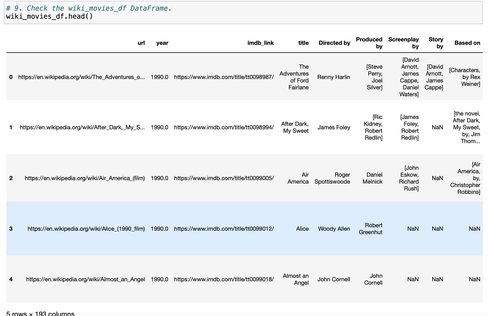

- The *kaggle_metadata* DataFrame
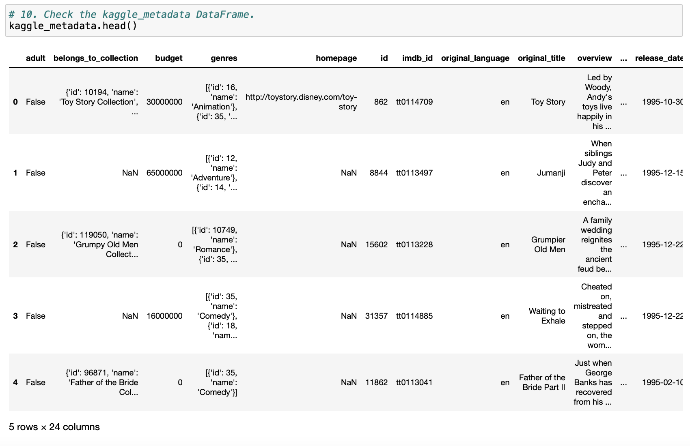

- The *ratings* DataFrame
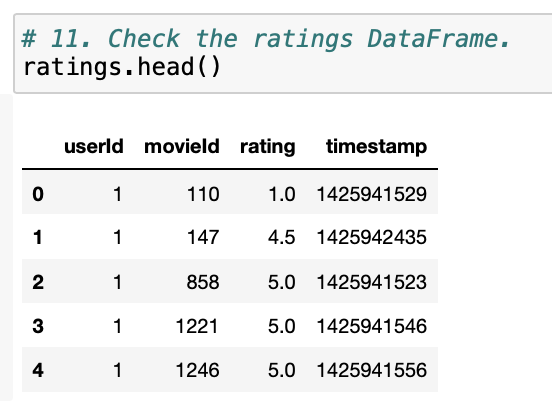

### Deliverable 2: Extract and Transform the Wikipedia Data
- *wiki_movies_df* DataFrame
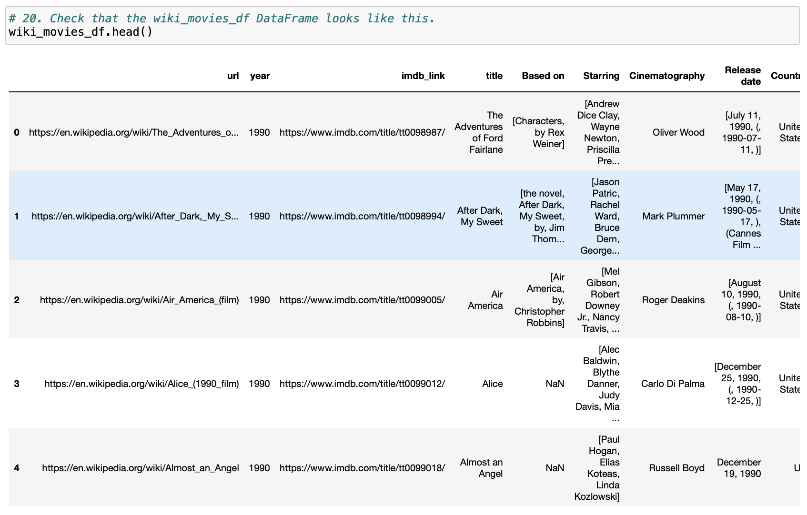

- A try-except block is used to catch errors while extracting the IMDb IDs with a regular expression and dropping duplicate IDs
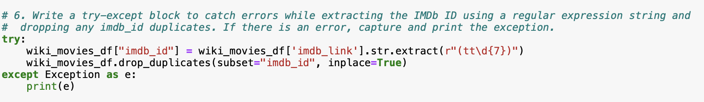

- add the columns from *wiki_movies_df* DataFrame to a list
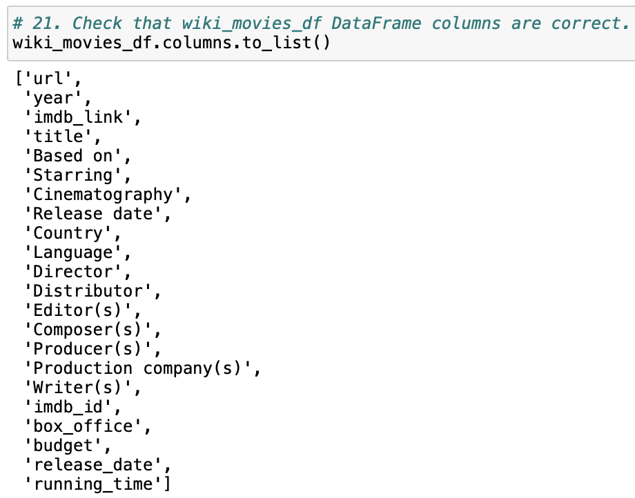

### Deliverable 3: Extract and Transform the Kaggle data
- *movies_with_ratings_df* DataFrame 
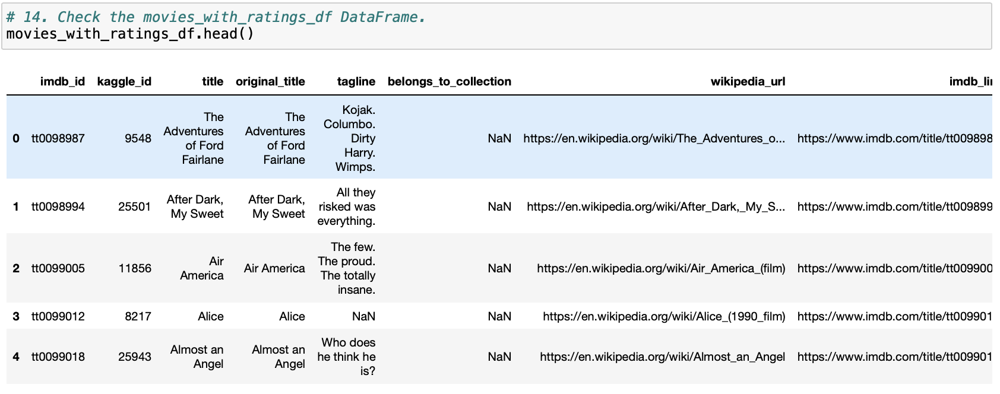

- *movies_df* DataFrame
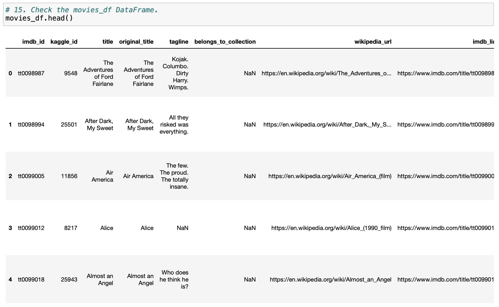

### Deliverable 4: Create the Movie Database
- The data from the movies_df DataFrame replaces the current data in the movies table in the SQL database, as determined by the *movies_query.png*
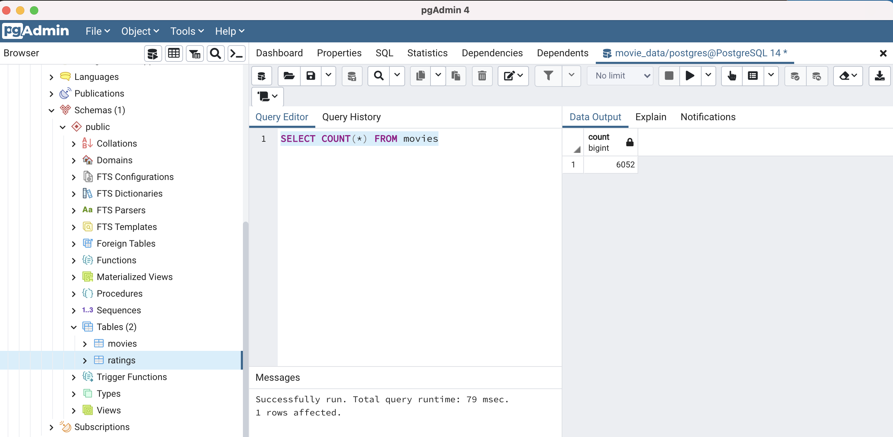

- The data from the MovieLens rating CSV file is added to the ratings table in the SQL database, as determined by the *ratings_query.png*.
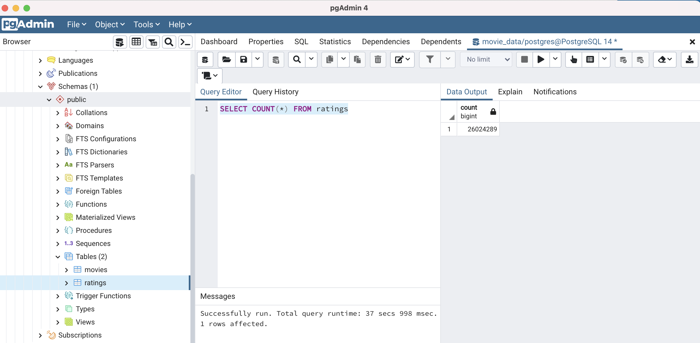

- The elapsed time to add the data to the database is displayed in the *ETL_create_database.ipynb* file

